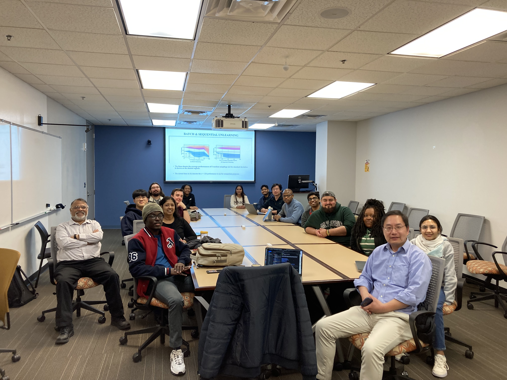
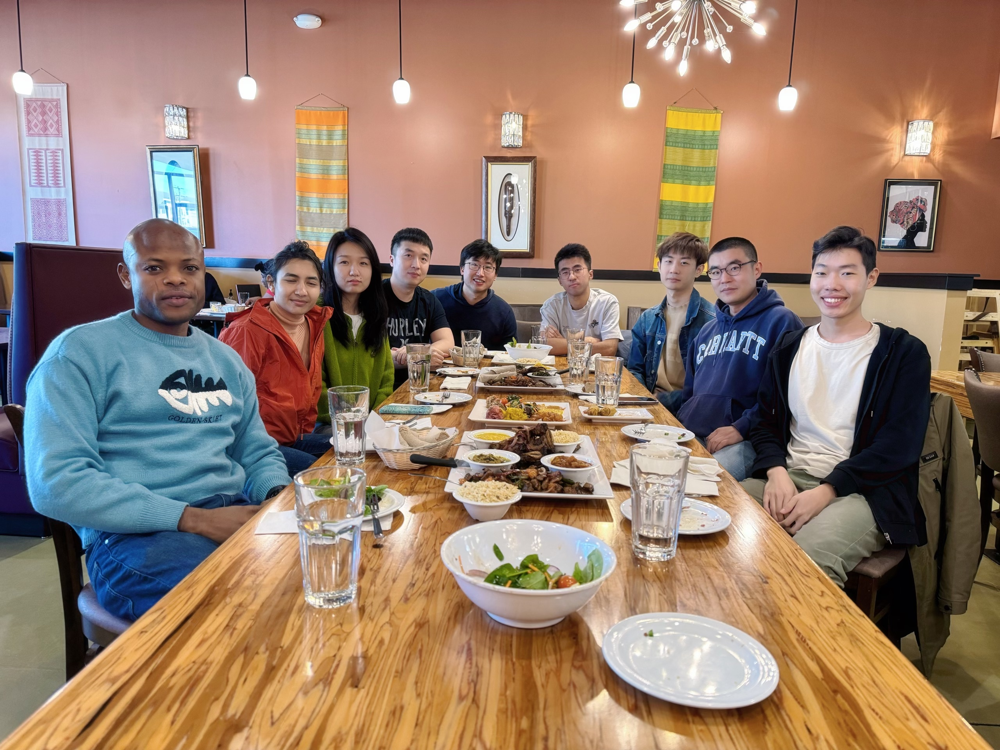
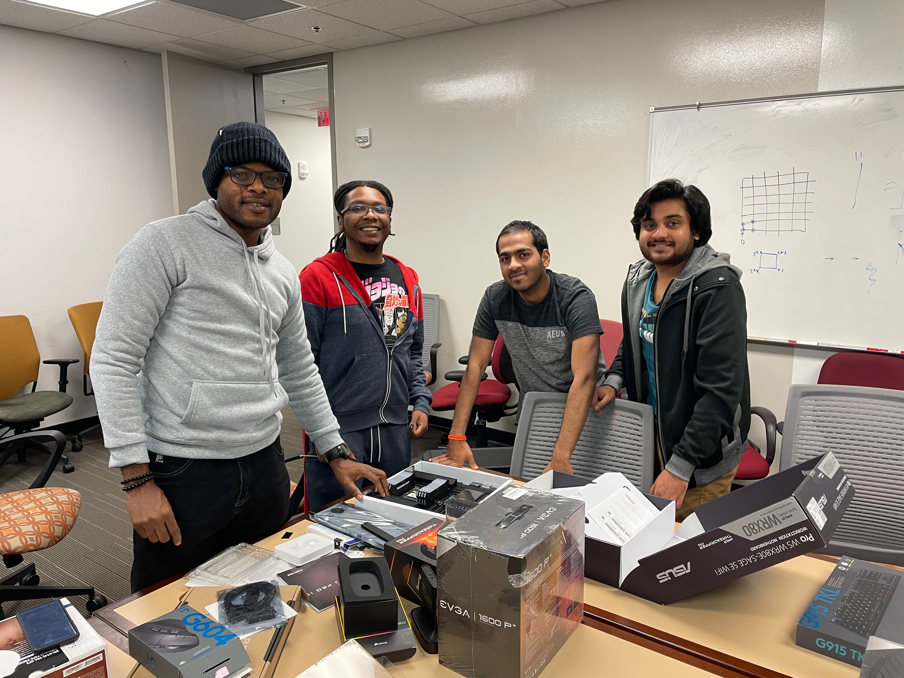

  

    

      
    

    

      
    

    

      
    

    

      
    

    

      
    

  

  <a class="carousel-control-prev" href="#carouselExampleIndicators" role="button" data-slide="prev">
    
    Previous
  </a>
  <a class="carousel-control-next" href="#carouselExampleIndicators" role="button" data-slide="next">
    
    Next
  </a>

  <!-- Display categorized projects -->
  
  <h2 class="category">{{ category }}</h2>
  

  
  
  <!-- Generate cards for each project -->
  

    
    <!-- 
 -->
    

      
    

    
  

  
  

